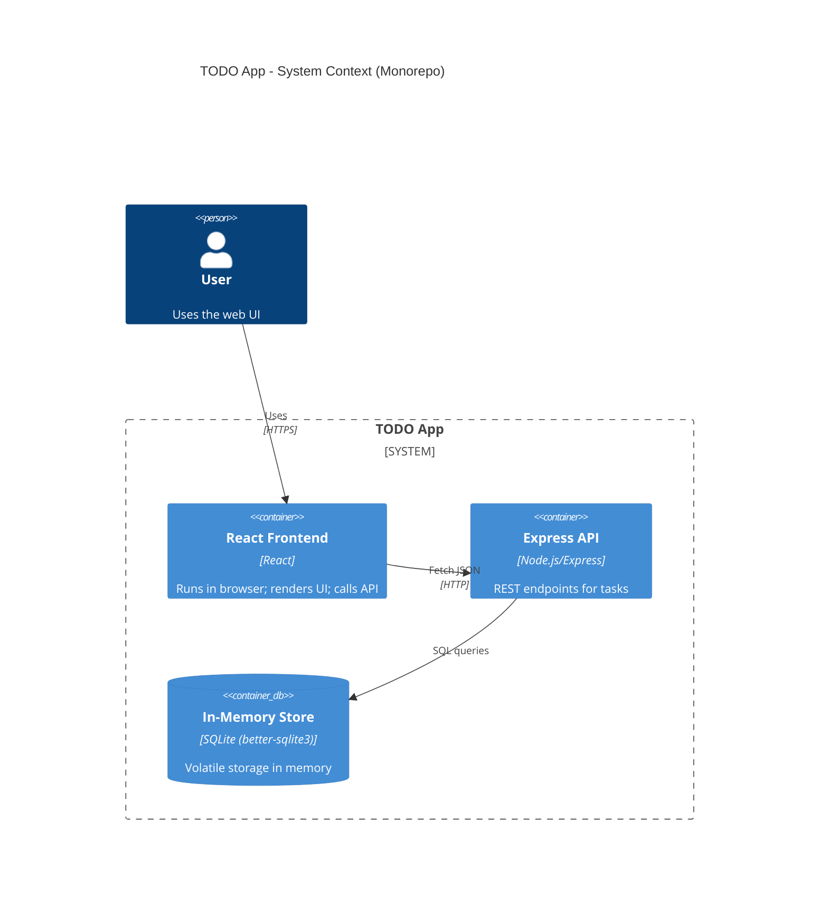
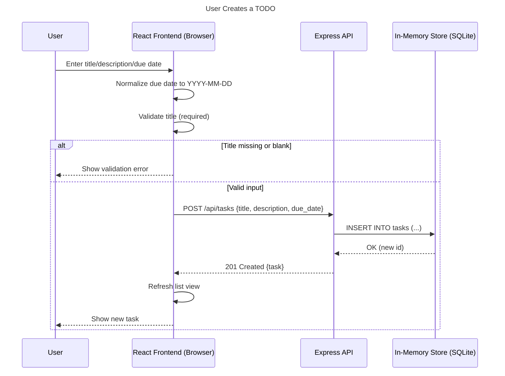

# Cloud Architecture Overview

This diagram shows the system context for the monorepo: a React frontend interacting with an Express API backed by an in-memory SQLite store (better-sqlite3). There are no external services or persistent cloud databases.

## User Creates a TODO – Sequence

